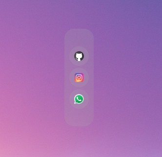

<div align="center">
    
</div>

# floating_action_bar

A quick floating action bar for desktops.

## configuration

Add Actions by editing,
`~/floating-action-bar/.config/app-config.json`.
```json
{
  "width": 60.0,
  "height": 200.0,
  "actions": [
    {
      "name": "github",
      "icon": "/home/omegaui/Downloads/dash-assets/icons8-github-96.png",
      "exec": [
        "firefox",
        "https://github.com/omegaui"
      ]
    },
    {
      "name": "instagram",
      "icon": "/home/omegaui/Downloads/dash-assets/icons8-instagram-96.png",
      "exec": [
        "firefox",
        "https://instagram.com"
      ]
    },
    {
      "name": "whatsapp",
      "icon": "/home/omegaui/Downloads/dash-assets/icons8-whatsapp-96.png",
      "exec": [
        "firefox",
        "https://web.whatsapp.com"
      ]
    }
  ]
}
```

that's it!!
